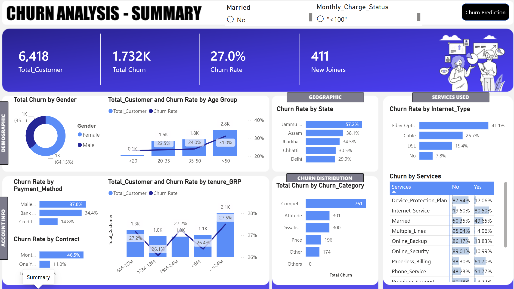
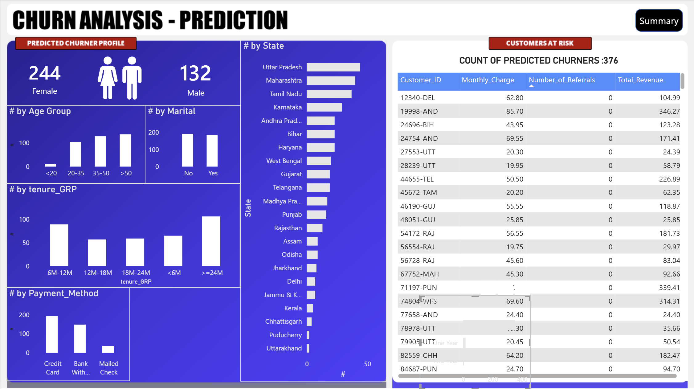

# 🧠 ChurnSense  
### Customer Lifecycle Intelligence & Experience Orchestration Engine

> “Not just predicting churn — orchestrating decisions across the customer lifecycle.”

---

## ⚡ Problem Context

In subscription-driven businesses, churn is not a one-time event.  
It is the result of progressive customer disengagement across lifecycle stages.

Most solutions:
- Detect churn too late  
- Focus only on reporting  
- Lack actionable outputs  

---

## 🎯 What I Built

An end-to-end customer intelligence system that transforms raw data into decisions.

Raw Customer Data → Predictive Signals → Business Actions

---

## 🧩 System Architecture

<pre>
Customer Data (Raw)
↓
SQL ETL Layer (Staging → Clean → Views)
↓
Analytical Layer (Segmentation + KPIs)
↓
Power BI Dashboard (Business View)
↓
Machine Learning Model
↓
Prediction Output (At-Risk Customers)
↓
Action Layer (Retention Targeting)
</pre>

---

## 🔍 Key Capabilities

### 1️⃣ Behavioral Intelligence (SQL + EDA)
- Customer segmentation by:
  - Contract type  
  - Tenure  
  - Revenue  
  - Services  
- Identified early churn patterns  

---

### 2️⃣ Business Dashboard (Power BI)
- Executive KPIs:
  - Total Customers  
  - Churn Rate  
  - Revenue  
- Interactive filters for deep analysis  
- Segment-level churn insights  

---

### 3️⃣ Predictive Intelligence (ML)
- Model: Random Forest  
- Objective: Predict future churn  

Clean Data → Encode → Train → Evaluate → Predict

- Output:
  - Customer-level churn prediction  
  - Binary classification (0 / 1)

---

### 4️⃣ Decision Layer
- Converted predictions into:
  - High-risk customer list  
  - Business-ready dataset  
- Enables proactive retention actions  

---

## 📊 Dashboard Insights (Power BI)

### 🔹 Churn Analysis Dashboard

This dashboard provides a comprehensive view of customer churn:

- KPIs Overview:
  - Total Customers: 6,418  
  - Total Churn: 1,732  
  - Churn Rate: 27%  
  - New Joiners: 411  

- Key Drivers:
  - Month-to-month contracts show highest churn  
  - Low tenure customers are more vulnerable  
  - Higher monthly charges increase churn risk  

- Business Value:
  - Identifies high-risk segments  
  - Supports retention strategy planning  

---

### 🔹 Churn Prediction Dashboard

This dashboard operationalizes machine learning predictions:

- Displays predicted churn customers  
- Provides customer-level profiling  
- Enables:
  - Targeted retention campaigns  
  - Personalized offers  

- Business Value:
  - Converts predictions into actionable insights  
  - Bridges analytics with decision-making  

---

## 🧠 Key Business Insights

- Month-to-month contracts → highest churn  
- High monthly charges → increased churn risk  
- Low tenure → high vulnerability  
- Fiber users → higher churn probability  

---

## 📊 Model Performance

- Accuracy: ~80%  
- Metrics:
  - Precision  
  - Recall  
  - F1 Score  
  - Confusion Matrix  

---

## 🛠️ Tech Stack

| Layer | Tools |
|------|------|
| Data | MySQL |
| Processing | Python (Pandas, NumPy) |
| Visualization | Power BI |
| ML | Scikit-learn |
| Analysis | SQL |

---

## 🧪 Engineering Decisions

- Maintained training vs prediction consistency  
- Handled unseen categories in new data  
- Avoided data leakage (excluded churn reason fields)  
- Built reusable SQL views for BI + ML  

---

## 🚀 Business Impact

- Early churn detection  
- Targeted retention strategies  
- Improved revenue stability  
- Better decision-making  

---

### Customer Lifecycle Segmentation

New → Active → At Risk → Churned

### Action Recommendation Layer

At Risk → Retain
High Value → Upsell
Stable → Monitor

## 🧠 My Approach
Data → System → Decision → Impact

---

## 🎯 Key Takeaway

This is not:
- A churn dashboard  
- A standalone ML model  

This is:
- A customer intelligence system  
- A decision-support engine  

---

## ⭐ If You Like This Project

- Star ⭐ the repo  
- Let’s connect and discuss data  

